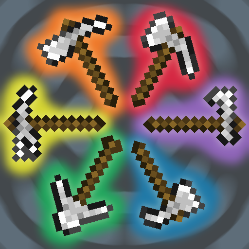

#  Contrasting Curses 

⚒️ Adds 6 simple multitool combinations, providing **two tools in one** to clear up hotbar space! 
⚖️ Balanced stats allow for **configurably decreased tool speed** and variable durability. 
🔗 Retains all **innate functionality** of both original tools (tilling/scraping/stripping etc). 
🔨 Upgrade existing tools to **transfer enchantments** and other data over. 
🧪 Add custom tool tiers for **data-driven mod support** with a single file! 
🔎 Tool names and art draw on similar **real life counterparts**! 
💭 Loosely inspired by the multitools added in Matcha Flavored.

## Mod Support

Several popular modded tool tiers have **builtin compatability**:
- [Aether](https://modrinth.com/mod/aether) (textures by RoarkCats)
- [Deep Aether](https://modrinth.com/mod/deep-aether) (textures by RoarkCats)
- [Better Nether](https://modrinth.com/mod/betternether-neoforge) (textures by Ninja75312)
- [Create Stuff 'N Additions](https://modrinth.com/mod/create-stuff-additions)
- [Create Ethium Reimagined](https://modrinth.com/mod/ethium) (textures by Cashhew)
- [Flint Required](https://modrinth.com/mod/flint-required) (textures by RoarkCats)
- [Unusual End](https://modrinth.com/mod/unusual_end)

Create an issue request to add additional builtin compats

## Questions

> **How do I add custom modded tool tiers?**
>
> Custom multitool tiers can be easily added with a single data pack JSON file! Read more on the [wiki](https://github.com/RoarkCats/dynamic-multitools/wiki/Dynamic-Tiers) for documentation on adding new tiers.

> **How can I change or disable the builtin tool tiers?**
>
> Any data pack can override or disable the same file path used by the mod's default data files provided as desired! Read more on the [wiki](https://github.com/RoarkCats/dynamic-multitools/wiki/Dynamic-Tiers#overriding).

> **Is there non-tinted texture support?**
>
> Yes! By using model overrides with custom model data and the dynamic tier components field you can implement any custom texture variants for your multitool tiers! Read more on the [wiki](https://github.com/RoarkCats/dynamic-multitools/wiki/Texture-Overrides).

> **I changed the configs but my tool hasn't changed!**
>
> Config changes and dynamic tier data pack changes only update on newly crafted/given items. This is due to the dynamic component-driven nature of the multitools which makes existing instances set-in-stone.

## License

Feel free to play, stream, or showcase this pack so long as visible credit is given.  
This project can be packaged into any server or modpack so long as significant modifications are disclosed.  
Do **not** redistribute or reupload this pack or its source code without permission.  
Please link to one of the official pack pages instead of redistributing files.  

*Copyright © 2026 RoarkCats.*  
*All rights reserved.* 
